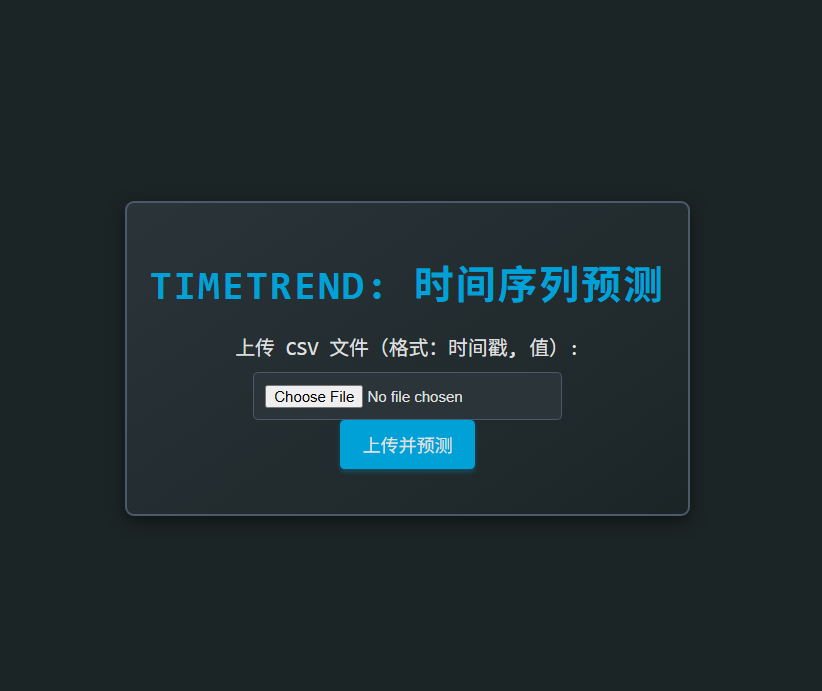
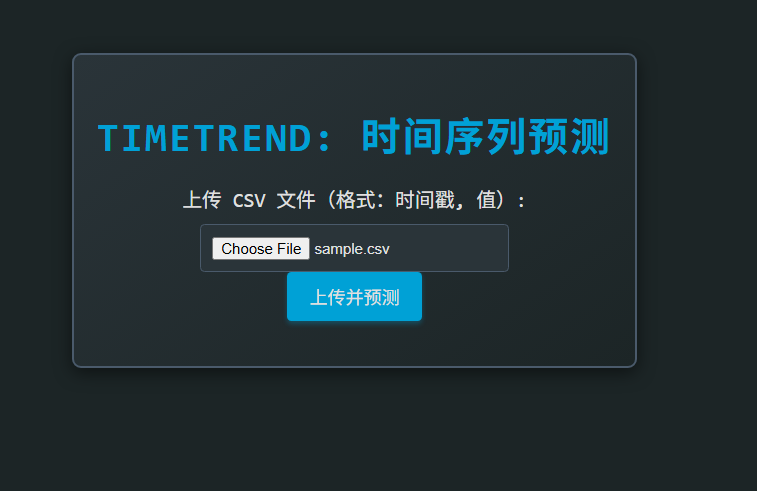
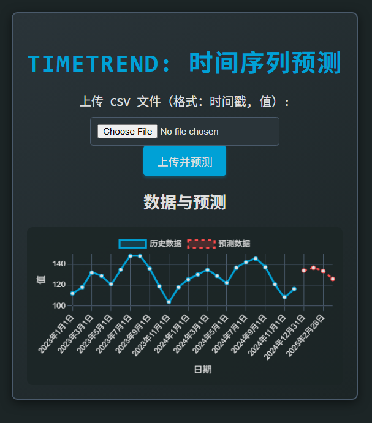

# forecast一个开源的、轻量级的时序数据预测演示项目，专为 Java 开发者设计，帮助他们快速上手深度学习在时序数据预测中的应用
# 安装
- jdk17
# 启动工程，查看识别效果，体验模型推理过程
- 执行[ForecastApplication](src/main/java/com/sandy/ml/forecast/ForecastApplication.java)启动类
- 访问http://localhost:8080

- 选择时序数据文件

- 上传并预测

# 类说明
- [TimeSeriesController](src/main/java/com/sandy/ml/forecast/TimeSeriesController.java) Spring MVC 控制器，负责处理首页展示和文件上传请求，调用服务进行时序预测，并将结果传递给前端页面。
- [TimeSeriesService](src/main/java/com/sandy/ml/forecast/TimeSeriesService.java) 业务服务层，负责解析上传的 CSV 文件，构造模型输入，调用深度学习模型进行预测，并封装结果。
- [TimeSeriesDataModel](src/main/java/com/sandy/ml/forecast/TimeSeriesDataModel.java) 用于在服务层保存原始时序数据、预测结果等，包含时间戳、原始值和预测值等字段。
- [TimeSeriesDataModelRsp](src/main/java/com/sandy/ml/forecast/TimeSeriesDataModelRsp.java) 用于前端展示的数据模型，将TimeSeriesDataModel中的时间戳转换为字符串，便于页面渲染。
- [DjlConfig](src/main/java/com/sandy/ml/forecast/DjlConfig.java) Spring 配置类，负责加载和初始化 DeepAR 时序预测模型，提供模型 Bean 给服务层使用。
