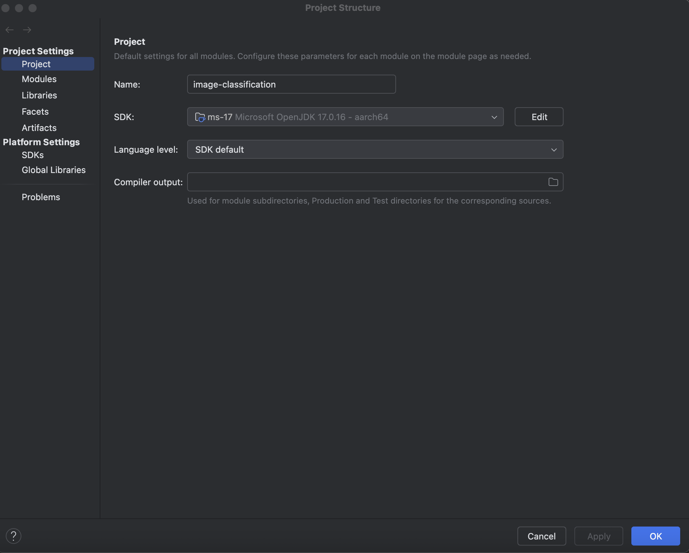
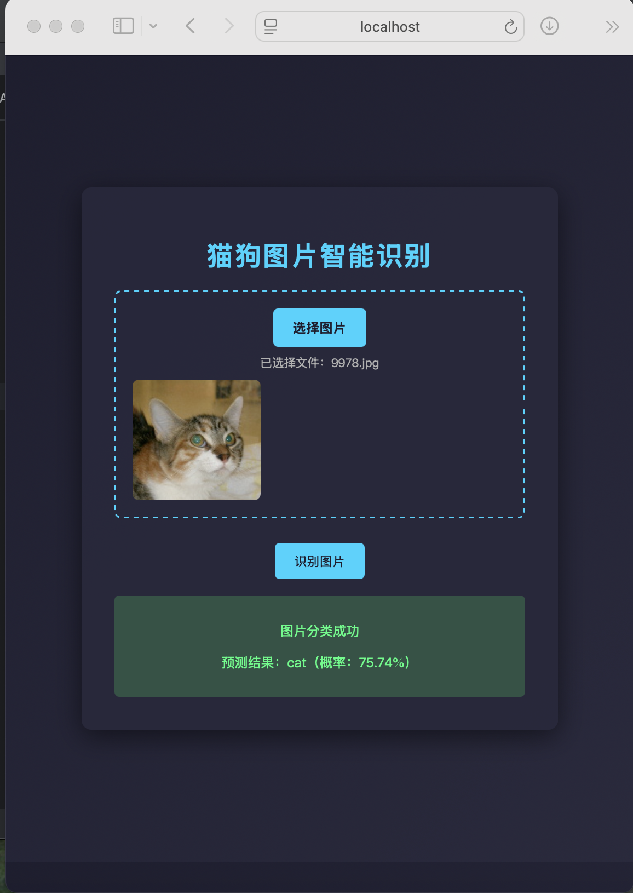

# （不需要GPU）使用DJL训练一个简单的卷积神经网络（CNN),开发一个基于Java的图像分类模型，用于区分猫和狗的图片

# 安装
- jdk17 ：需要针对自己的CPU型号设置好，我用的是苹果电脑，Mac Pro M4芯片，用的是Microsoft openjdk17.0.16 aarch64

- 也可以执行TestDJL类，去测试是否具备训练卷积神经网络（CNN)的添加
# 启动工程，查看识别效果，体验模型推理过程
- 执行[ImageClassificationApplication](src/main/java/com/sandy/ml/image/classification/ImageClassificationApplication.java)启动类
- 访问http://localhost:8080/classify

- 上传猫或者狗的图片，可以去[src/main/resources/kagglecatsanddogs_5340/PetImages](src/main/resources/kagglecatsanddogs_5340/PetImages)选择猫或者狗的图片上传
- 识别图片，显示识别效果
# 训练模型，体验训练过程
- 数据预处理,使用Java处理图像（调整大小、归一化），执行类[ImagePreprocessor](src/main/java/com/sandy/ml/image/classification/ImagePreprocessor.java)
- 使用DJL训练一个简单的CNN模型,执行类[TrainCatsVsDogs](src/main/java/com/sandy/ml/image/classification/TrainCatsVsDogs.java)
# 验证推理效果，将训练好的模型部署为本地服务，使用Java进行推理
- 执行类[Inference](src/main/java/com/sandy/ml/image/classification/Inference.java)
# 其他类
- [ImageClassificationService](src/main/java/com/sandy/ml/image/classification/ImageClassificationService.java) 推理service，进行推理逻辑处理，满足web界面调用的逻辑处理要求
- [ImageClassificationController](src/main/java/com/sandy/ml/image/classification/ImageClassificationController.java)猫狗识别API
- [upload.html](src/main/resources/templates/upload.html) 猫狗识别前端界面